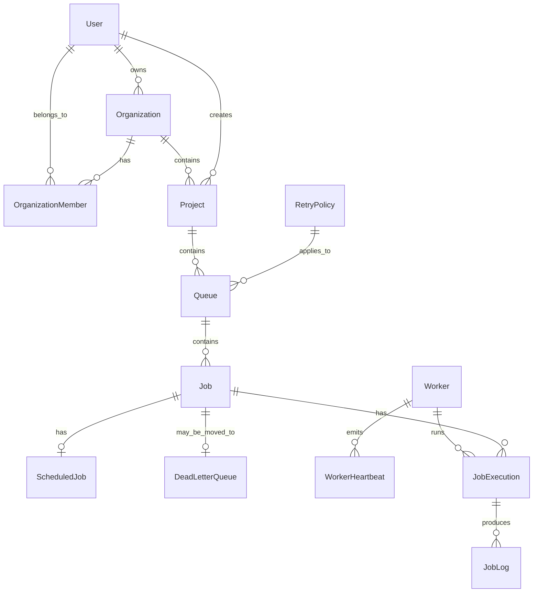

# ER Diagram

## Relationship Summary

- Each organization has one owner and many members.
- Each project belongs to one organization and may have many queues.
- Each queue belongs to one project and can use one retry policy.
- Each job belongs to one queue and can produce many execution attempts.
- Each execution attempt can produce many logs.
